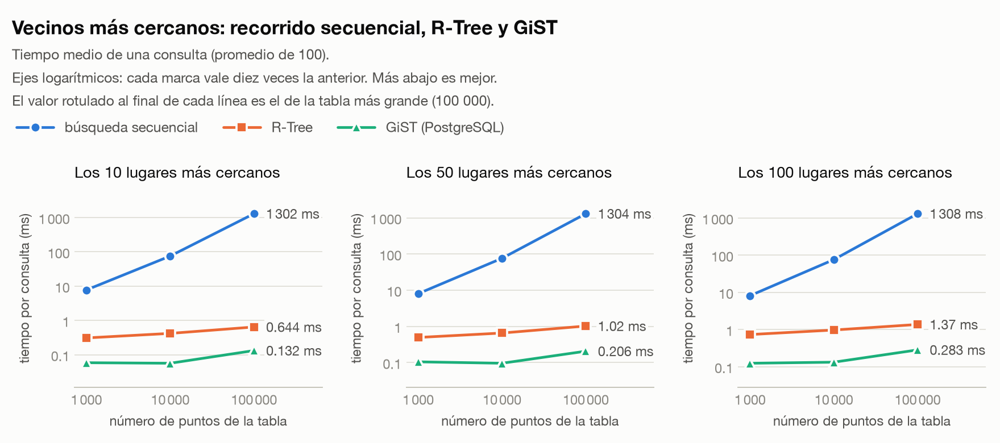

# Minigestor de Base de Datos Multimodal

Gestor de base de datos construido desde cero para el curso Base de Datos 2 (UTEC): sin ORM,
sin motor externo y sin librerías que resuelvan las estructuras. La especificación completa
está en [`Proyecto_Integrador_BD2.md`](./Proyecto_Integrador_BD2.md).

| Parte | Estado | Qué incluye |
|---|---|---|
| **1. Relacional** | completa | heap file, archivo secuencial, B+ agrupado y no agrupado, hash extendible, ordenamiento y hashing externos, parser y ejecutor SQL, transacciones con detección de interbloqueos, API REST e interfaz |
| **2. Espacial** | completa | R-Tree sobre disco, consultas por radio, k-NN y por polígono, distancias euclidiana y Haversine, extensión del SQL y panel de mapa |

- **Informe** de las dos partes, con la parte experimental: [`docs/informe.pdf`](docs/informe.pdf)
- **Comparación experimental** completa, con gráficas y tablas: [`benchmarks/README.md`](benchmarks/README.md)

Contenido de este documento:
[1. Arquitectura del sistema](#1-arquitectura-del-sistema) ·
[2. Organización del código fuente](#2-organización-del-código-fuente) ·
[3. Manual de instalación](#3-manual-de-instalación) ·
[4. Uso](#4-uso)

---

## 1. Arquitectura del sistema

```
              frontend/ (React + TypeScript + Leaflet)
                      │  HTTP
              src/api/ (FastAPI)       una sesión por pestaña del navegador
                      │
              src/txn/                 sesiones, bloqueos en dos fases, deshacer
                      │
              src/query/               catálogo · planificador · operadores (Volcano)
                 ┌────┴────┐
          src/sql/     src/index/      B+ agrupado, B+ no agrupado, hash extendible, R-Tree
                            │
                       src/external/   ordenamiento, hashing y bucles anidados externos
                            │
                       src/storage/    registros · páginas · buffer pool
                            │          heap file · archivo secuencial
                       src/spatial/    puntos, rectángulos, polígonos y distancias
```

**Cada capa solo conoce a la de abajo**: el motor no sabe qué es una transacción, y ninguna
capa del motor sabe que existe un API.

### El camino de una consulta

```
texto SQL → lexer → parser (AST) → validación de tipos → planificador → operadores → filas + plan
```

Toda consulta devuelve, además de sus filas, el **plan de ejecución**: el árbol de
operadores con el camino de acceso que eligió el planificador. Con `EXPLAIN ANALYZE` cada
operador lleva las filas que entregó y el tiempo que tardó.

### Decisiones de diseño

| Decisión | Consecuencia |
|---|---|
| **Todo opera por páginas** de 4 KB, pedidas a un único paginador con buffer pool LRU | ninguna estructura carga un archivo entero en memoria |
| **Registros de tamaño fijo** | la posición de un registro es una multiplicación; la capacidad de un nodo se deduce del tamaño de página |
| **Una sola implementación de cada cosa** (serialización, páginas, distancias, reglas de tipos) | una consulta responde lo mismo recorra la tabla o use un índice |
| **Nada incrustado**: parámetros en `EngineConfig`, rutas y direcciones en variables de entorno | cambiar el tamaño de página cambia el orden de todos los árboles sin tocar su código |
| **Se valida antes de leer** | una consulta con una columna inexistente o un tipo equivocado falla aunque la tabla esté vacía |

### Qué resuelve cada requisito del enunciado

| Requisito | Técnica implementada | Módulo |
|---|---|---|
| Heap file con reutilización de espacio | lista enlazada de páginas con ranuras libres | [`storage/heap`](src/storage/heap/README.md) |
| Archivo secuencial | espacio principal ordenado, desbordamiento, lápidas y reorganización al 30 % | [`storage/sequential`](src/storage/sequential/README.md) |
| Índice B+ agrupado y no agrupado | un nodo por página; división, redistribución y fusión | [`index/bplustree`](src/index/bplustree/README.md) |
| Hash dinámico | hash extendible: duplicación del directorio, división y fusión de cubetas | [`index/hash`](src/index/hash/README.md) |
| `ORDER BY` externo | generación de runs y mezcla de k vías | [`external/sort`](src/external/sort/README.md) |
| `GROUP BY` y `JOIN` externos | particionado por hash, *grace hash join*, bucles anidados en bloques | [`external/hash`](src/external/hash/README.md), [`external/loop`](src/external/loop/README.md) |
| Parser SQL | lexer y parser recursivo descendente, validación, planificador y ejecutor de iteradores | [`sql`](src/sql/README.md), [`query`](src/query/README.md) |
| Transacciones y concurrencia | bloqueo en dos fases, grafo de espera, registro de deshacer | [`txn`](src/txn/README.md) |
| Índice R-Tree | R-Tree de Guttman sobre disco, con carga masiva STR | [`index/rtree`](src/index/rtree/README.md) |
| Radio, k-NN y polígono | poda por distancia al MBR, búsqueda primero-el-mejor, filtrar y refinar | [`index/rtree`](src/index/rtree/README.md), [`spatial`](src/spatial/README.md) |
| Euclidiana y Haversine | una sola implementación compartida | [`spatial`](src/spatial/README.md) |
| Interfaz y panel de mapa | cuatro paneles visibles a la vez; mapa con Leaflet | [`frontend`](frontend/README.md) |
| Comparación experimental | tres experimentos medidos, con resultados crudos y gráficas | [`benchmarks`](benchmarks/README.md) |

---

## 2. Organización del código fuente

```
src/                 raíz de importación: un paquete por módulo del motor
  sql/               tokens, lexer, AST inmutable y parser (con la gramática en su README)
  storage/           tipos, registros, páginas y paginador
    heap/            heap file
    sequential/      archivo secuencial paginado
  index/             una carpeta por estructura
    bplustree/       árbol B+ agrupado y no agrupado
    hash/            hash extendible
    rtree/           R-Tree
  external/          algoritmos externos: sort/, hash/ y loop/
  spatial/           geometría y métricas de distancia; no depende de ningún otro paquete
  query/             catálogo, tabla, planificador, operadores y motor
  txn/               gestor de bloqueos, transacciones y sesiones
  api/               API REST (FastAPI) sobre el motor
frontend/            interfaz: React + TypeScript + Vite; Leaflet en el panel de mapa
tests/               espejo de la estructura de src/, más benchmarks/ y demos/
benchmarks/          experimentos reproducibles
  results/           medidas crudas en JSON
  figures/           gráficas generadas a partir de esos JSON
demos/               generador del dataset, descarga de lugares reales y simulación de concurrencia
  samples/           los CSV del dataset de demostración
docs/                informe.pdf y su fuente LaTeX
```

No hay paquete paraguas: `src` es la raíz de importación, así que se escribe
`from index.bplustree import BPlusTree`. **Cada estructura del enunciado vive en su propia
carpeta, con su README**, para que el mapa del repositorio se lea igual que el mapa del
proyecto:

| Carpeta | Contenido | Documentación |
|---|---|---|
| [`src/sql/`](src/sql/) | lexer, AST y parser | [README y gramática](src/sql/README.md) |
| [`src/storage/`](src/storage/) | tipos, registros, páginas, paginador | [README](src/storage/README.md) |
| [`src/storage/heap/`](src/storage/heap/) | heap file | [README](src/storage/heap/README.md) |
| [`src/storage/sequential/`](src/storage/sequential/) | archivo secuencial paginado | [README](src/storage/sequential/README.md) |
| [`src/index/bplustree/`](src/index/bplustree/) | árbol B+ agrupado y no agrupado | [README](src/index/bplustree/README.md) |
| [`src/index/hash/`](src/index/hash/) | hash extendible | [README](src/index/hash/README.md) |
| [`src/index/rtree/`](src/index/rtree/) | R-Tree: radio, k-NN, polígono, carga masiva | [README](src/index/rtree/README.md) |
| [`src/spatial/`](src/spatial/) | geometría y métricas euclidiana y Haversine | [README](src/spatial/README.md) |
| [`src/external/`](src/external/) | ordenamiento, hashing y bucles anidados externos | [README](src/external/README.md) |
| [`src/query/`](src/query/) | catálogo, planificador, ejecutor | [README](src/query/README.md) |
| [`src/txn/`](src/txn/) | transacciones y concurrencia | [README](src/txn/README.md) |
| [`src/api/`](src/api/) | API REST | [README](src/api/README.md) |
| [`frontend/`](frontend/) | interfaz de 4 paneles y panel de mapa | [README](frontend/README.md) |
| [`benchmarks/`](benchmarks/) | comparación experimental, con resultados y gráficas | [README](benchmarks/README.md) |
| [`demos/`](demos/) | datasets de demostración y simulación de concurrencia | [README](demos/README.md) |

Convenciones que se cumplen en todo el código: nombres en inglés, funciones cortas, errores
con excepciones del dominio, anotaciones de tipo en toda firma pública (`mypy` estricto y
`ruff` pasan limpios) y ningún valor mágico dentro de una función.

---

## 3. Manual de instalación

### 3.1 Requisitos

| Para | Hace falta |
|---|---|
| el motor y el API | Python 3.11 o posterior |
| la interfaz | Node.js 18 o posterior |
| redibujar las gráficas (opcional) | `matplotlib`, que se instala con el extra `plots` |
| medir contra GiST (opcional) | PostgreSQL con la extensión PostGIS y el extra `postgres` |

### 3.2 Instalar

```bash
git clone https://github.com/JoseEd0/project-BD2.git
cd project-BD2

# motor, API y herramientas de desarrollo
python3 -m venv .venv
.venv/bin/pip install -e ".[dev]"

# interfaz
npm --prefix frontend install
cp frontend/.env.example frontend/.env
```

### 3.3 Poblar la base de datos y arrancar

```bash
# 1. dataset de demostración: un e-commerce de cinco tablas y 3 000 tiendas con ubicación
.venv/bin/python demos/poblar_ecommerce.py --data-dir ./data

# 2. API, en http://localhost:8000 (documentación interactiva en /docs)
MINIGESTOR_DATA_DIR=./data .venv/bin/uvicorn api.main:app --port 8000

# 3. interfaz, en http://localhost:5173
npm --prefix frontend run dev
```

El dataset carga unas 30 000 filas en seis tablas, **cada una con una organización física
distinta**, para que las diferencias entre estructuras se vean en la interfaz. Los detalles
están en [`demos/README.md`](demos/README.md).

### 3.4 Cargar datos desde la interfaz

Con la base vacía también se puede empezar sin la terminal. El botón **Cargar CSV** crea
una tabla a partir de un archivo con cabecera, deduciendo los tipos de su contenido, con la
organización que se elija:

| Opción | Qué crea |
|---|---|
| **Sin índice** | heap file sin clave ni índices: el punto de partida para comparar |
| **Heap file + índice hash** | heap con clave primaria y un índice hash sobre ella |
| **B+ agrupado** | las filas viven en las hojas del árbol |
| **Archivo secuencial** | filas ordenadas por la clave |

Los seis CSV del dataset están en [`demos/samples/`](demos/samples/):

| Archivo | Organización | Clave |
|---|---|---|
| `categorias.csv`, `clientes.csv`, `detalle_pedidos.csv`, `tiendas.csv` | Heap file + índice hash | `id` |
| `productos.csv` | B+ agrupado | `id` |
| `pedidos.csv` | Archivo secuencial | `id` |

Después, el atajo **Carga → Índices tras cargar CSV** crea los dos índices secundarios del
e-commerce, y **Espacial → Crear R-Tree**, el de `tiendas.ubicacion`. Con eso los 41 atajos
del editor quedan listos para usarse.

**Datos espaciales reales.** Para probar el R-Tree con lugares de verdad —unos 128 000
puntos de interés del Perú, de OpenStreetMap— hay un guion que los descarga en el formato
que carga el gestor:

```bash
.venv/bin/python demos/descargar_lugares.py --salida data/datasets/lugares_lima.csv \
    --recuadro -12.52 -77.20 -11.57 -76.62
```

### 3.5 Variables de entorno

Ninguna ruta, puerto ni credencial está escrita en el código. Las del API y los experimentos
están en [`.env.example`](.env.example); las de la interfaz, en
[`frontend/.env.example`](frontend/.env.example).

| Variable | Para qué | Por defecto |
|---|---|---|
| `MINIGESTOR_DATA_DIR` | dónde viven los archivos del gestor | `data` |
| `MINIGESTOR_CORS_ORIGINS` | orígenes a los que el API permite llamar | `http://localhost:5173` |
| `MINIGESTOR_LOCK_TIMEOUT` | segundos que una transacción espera un bloqueo | `5` |
| `VITE_API_URL` | dirección del API que usa la interfaz | `http://localhost:8000` |
| `BENCH_POSTGRES_DSN` | conexión al PostgreSQL contra el que se mide GiST | — |

### 3.6 Comprobar la instalación

```bash
.venv/bin/ruff check                          # estilo
.venv/bin/mypy                                # tipos, en modo estricto
.venv/bin/python -m pytest -q                 # 1287 tests
npm --prefix frontend run build               # tipos y bundle de la interfaz
```

Los tests siguen la estructura de `src/`, así que se pueden ejecutar por módulo:

```bash
.venv/bin/python -m pytest tests/storage -q
.venv/bin/python -m pytest tests/index/rtree -q
.venv/bin/python -m pytest tests/query -q
```

### 3.7 Reproducir los experimentos

```bash
.venv/bin/pip install -e ".[plots,postgres]"
.venv/bin/python -m benchmarks.storage_benchmark --sizes 1000 10000 100000
.venv/bin/python -m benchmarks.index_benchmark   --sizes 1000 10000 100000

# el espacial, sobre los lugares reales y contra PostGIS
.venv/bin/python demos/descargar_lugares.py --salida data/datasets/lugares_peru.csv
BENCH_POSTGRES_DSN="dbname=minigestor_bench" .venv/bin/python -m benchmarks.spatial_benchmark \
    --sizes 1000 10000 100000 --points-file data/datasets/lugares_peru.csv

.venv/bin/python -m benchmarks.plot           # redibuja las gráficas
.venv/bin/python demos/concurrencia.py        # race condition, transacciones e interbloqueo
```

Los resultados medidos y sus gráficas están versionados en
[`benchmarks/results/`](benchmarks/results/) y [`benchmarks/figures/`](benchmarks/figures/).
Una muestra, con 100 000 lugares reales de OpenStreetMap: encontrar los 10 más cercanos tarda
**1 302 ms** recorriendo la tabla y **0.64 ms** con el R-Tree.



---

## 4. Uso

### SQL

```sql
CREATE TABLE t (id INT PRIMARY KEY INDEX BTREE, nombre VARCHAR(30) UNIQUE, ciudad VARCHAR(20) INDEX HASH);
CREATE TABLE t FROM FILE "datos.csv" USING INDEX BTREE("id");
CREATE INDEX idx ON t USING HASH (ciudad);
INSERT INTO t VALUES (1, 'ana', 'lima'), (2, 'luis', 'cusco');
SELECT ciudad, COUNT(*) AS total FROM t WHERE id BETWEEN 1 AND 9 GROUP BY ciudad ORDER BY total DESC LIMIT 10;
SELECT a.nombre, b.v FROM t AS a LEFT JOIN otra AS b ON a.id = b.id AND b.v > 10;
UPDATE t SET nombre = 'x' WHERE id = 1;
DELETE FROM t WHERE ciudad = 'lima';
EXPLAIN ANALYZE SELECT * FROM t WHERE ciudad = 'cusco';
BEGIN TRANSACTION;  ...  END TRANSACTION;   -- o COMMIT / ROLLBACK
```

Las fechas se escriben como texto ISO (`WHERE fecha >= '2025-01-01'`). Solo se comparan
valores del mismo tipo: `WHERE id = 'abc'` se rechaza con un error que nombra la columna,
en vez de devolver cero filas. Y una sentencia que falla a mitad no deja nada escrito.

### SQL espacial

```sql
CREATE TABLE tiendas (id INT PRIMARY KEY, nombre VARCHAR(40), ubicacion POINT INDEX RTREE);
INSERT INTO tiendas VALUES (1, 'Centro', POINT(-12.0464, -77.0428));   -- latitud, longitud

-- por radio: a menos de 5 km (Haversine, en metros)
SELECT * FROM tiendas WHERE distancia(ubicacion, POINT(-12.0464, -77.0428)) < 5000;
-- los 10 más cercanos
SELECT * FROM tiendas ORDER BY distancia(ubicacion, POINT(-12.0464, -77.0428)) LIMIT 10;
-- dentro de un polígono
SELECT * FROM tiendas WHERE intersecta(ubicacion, POLYGON((-12.11, -77.05), (-12.11, -77.01), (-12.14, -77.01)));
-- distancia euclidiana, en grados
SELECT nombre, distancia(ubicacion, POINT(-12.0464, -77.0428), metrica='euclidiana') FROM tiendas;
```

Las tres consultas funcionan con o sin índice; con un `RTREE` sobre la columna, el plan de
ejecución pasa de `SequentialScan` a `SpatialRangeScan`, `SpatialNearestScan` o
`SpatialPolygonScan` y dice cuántos nodos del árbol abrió. La gramática completa está en
[`src/sql/README.md`](src/sql/README.md).

### Desde Python

```python
from config import EngineConfig
from query.engine import Engine

with Engine(EngineConfig()) as engine:
    engine.execute("CREATE TABLE alumnos (id INT PRIMARY KEY, ciudad VARCHAR(20) INDEX HASH)")
    engine.execute("INSERT INTO alumnos VALUES (1, 'lima')")
    result = engine.execute("SELECT * FROM alumnos WHERE ciudad = 'lima'")
    print(result.rows)
    print(result.plan.render())
```

## Autor

**José Huamaní** — Ciencias de la Computación, UTEC
