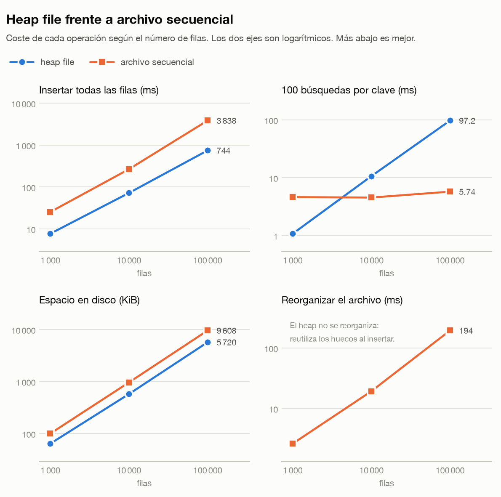
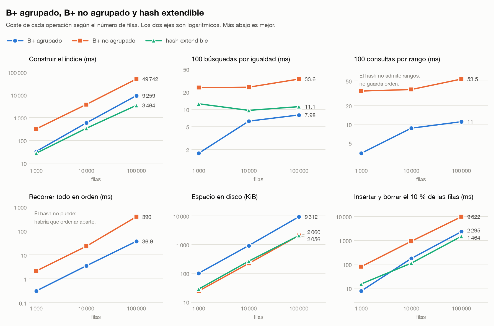
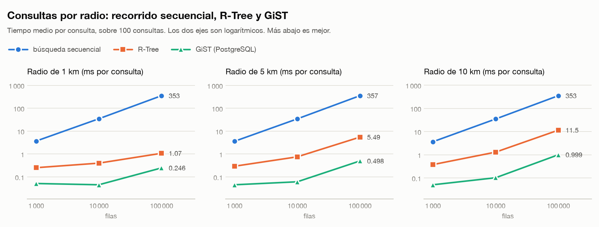
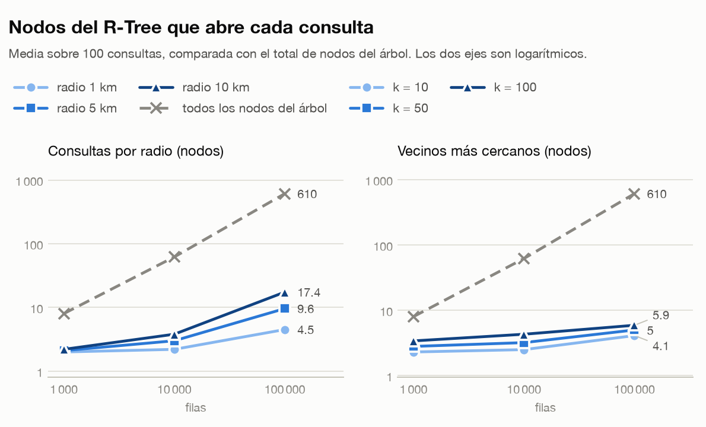
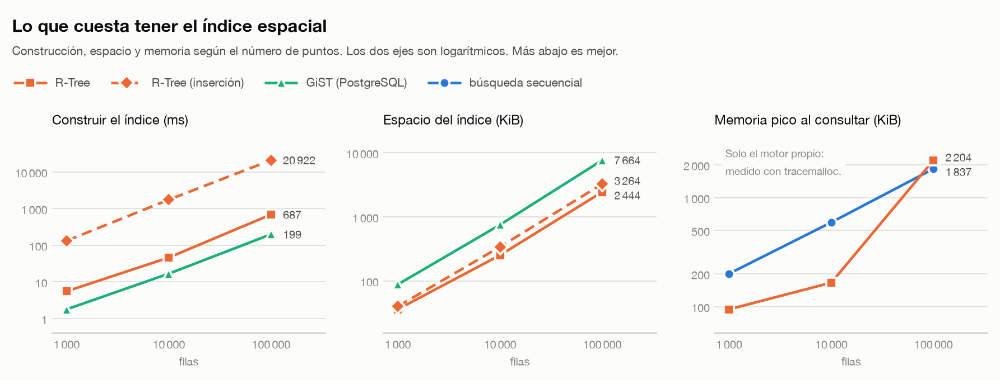

# Comparación experimental

Todo lo que se reporta se **mide**. Cada script recibe sus parámetros por línea de comandos
—ningún tamaño ni número de repeticiones está escrito dentro del código—, imprime una tabla
Markdown y guarda los resultados crudos en [`results/`](results/). De esos JSON salen las
gráficas de [`figures/`](figures/) y todas las tablas de este documento.

```bash
.venv/bin/python -m benchmarks.storage_benchmark --sizes 1000 10000 100000 --queries 100
.venv/bin/python -m benchmarks.index_benchmark   --sizes 1000 10000 100000 --queries 100
.venv/bin/python -m benchmarks.spatial_benchmark --sizes 1000 10000 100000 --queries 100
.venv/bin/python -m benchmarks.plot              # redibuja todas las gráficas
```

| Argumento | Qué controla |
|---|---|
| `--sizes` | tamaños del conjunto de datos |
| `--queries` | consultas por medida |
| `--seed` | semilla del generador; misma semilla, mismos datos |
| `--page-size` | tamaño de página del motor (almacenamiento e índices) |
| `--radii-km`, `--neighbours` | radios y valores de `k` del experimento espacial |
| `--postgres-dsn` | conexión al PostgreSQL contra el que se mide GiST |
| `--output` | dónde dejar el JSON |

| Experimento | Qué compara | Gráficas |
|---|---|---|
| [1. Gestión de archivos](#1-gestión-de-archivos--heap-vs-secuencial) | heap file vs archivo secuencial | [almacenamiento](figures/almacenamiento.png) |
| [2. Indexación](#2-indexación--b-agrupado-vs-b-no-agrupado-vs-hash-extendible) | B+ agrupado vs B+ no agrupado vs hash extendible | [índices](figures/indices.png) |
| [3. Datos espaciales](#3-datos-espaciales--búsqueda-secuencial-vs-r-tree-vs-gist) | búsqueda secuencial vs R-Tree vs GiST de PostgreSQL | [radio](figures/espacial-radio.png), [k-NN](figures/espacial-knn.png), [índice](figures/espacial-indice.png), [nodos](figures/espacial-nodos.png) |

**Cómo leer las gráficas.** Cada una es una fila de paneles, uno por operación, con el
número de filas en horizontal y una línea por técnica. Los dos ejes son logarítmicos: los
tamaños van de 1 000 a 100 000 y los tiempos cubren cuatro órdenes de magnitud, así que en
escala lineal solo se vería la técnica más lenta. En un eje logarítmico **la pendiente dice
cómo escala** la técnica: una línea plana no depende del tamaño y una a 45° crece en
proporción a él. El número junto al último punto es el valor con 100 000 filas.

## 1. Gestión de archivos — heap vs secuencial

`storage_benchmark.py` mide inserción, búsqueda por clave primaria, espacio en disco,
borrado y reorganización.

### Resultados medidos

Ejecución con `--sizes 1000 10000 100000 --queries 100`, páginas de 4 KB
(macOS, Python 3.12). Las búsquedas son el total de 100 consultas.



En el panel de búsqueda se ve el cruce: la línea del heap sube a 45° y la del secuencial
es casi plana.

| Operación | Técnica | 1 000 | 10 000 | 100 000 |
|---|---|---:|---:|---:|
| Inserción (ms) | heap | **8.2** | **68.7** | **751** |
| | secuencial | 25.4 | 267.1 | 3 876 |
| Búsqueda por clave (ms) | heap | **1.0** | 10.1 | 95.4 |
| | secuencial | 4.1 | **4.2** | **5.4** |
| Espacio (KiB) | heap | **64** | **576** | **5 720** |
| | secuencial | 100 | 964 | 9 608 |
| Reorganización (ms) | secuencial | 2.1 | 18.5 | 185.6 |

### Conclusiones

**El cruce está entre 1 000 y 10 000 filas.** Con 1 000 registros el recorrido completo del
heap (1.0 ms) gana a la búsqueda binaria del secuencial (4.1 ms): recorrer 8 páginas
seguidas sale más barato que dar 10 saltos. A partir de ahí la asimetría se dispara —el
heap crece lineal (1 → 10 → 95 ms) y el secuencial casi no se mueve (4.1 → 4.2 → 5.4 ms)—
y con 100 000 filas **el secuencial busca 18 veces más rápido**.

El precio del orden se paga al escribir: insertar cuesta **5 veces más** en el secuencial,
porque cada inserción localiza la página y desplaza bytes dentro de ella, y cada tanto se
dispara una reorganización. También ocupa **1.7 veces más espacio**, y eso es deliberado:
el factor de llenado del 80 % deja hueco para que las inserciones futuras quepan en su
sitio en vez de irse al desbordamiento.

**Cuándo usar cada uno:** heap si se escribe mucho y se consulta siempre por índice;
secuencial si se consulta por clave o por rango y las escrituras son la minoría.

### Resumen: ventajas y desventajas

| | Heap file | Archivo secuencial |
|---|---|---|
| **Ventajas** | Inserción `O(1)`: va directo a la cabeza de la lista de libres · el menor espacio en disco · reutiliza los huecos de los borrados sin ningún trabajo diferido · sin coste oculto | Búsqueda por clave `O(log P)`: 18× más rápido con 100 000 filas · rangos y recorrido ordenado gratis, sin ordenar nada · el orden se mantiene siempre disponible |
| **Desventajas** | Búsqueda por valor `O(P)`: hay que recorrer el archivo entero · un rango o un `ORDER BY` obligan a ordenar aparte · inútil sin un índice encima | Inserción 5× más lenta: localiza la página y desplaza bytes · 1.7× más espacio por el factor de llenado del 80 % · reorganizaciones periódicas que congelan el archivo · el desbordamiento degrada la búsqueda hasta que se reorganiza |
| **Se elige cuando** | Carga masiva, tablas que siempre se consultan por índice, orden de lectura irrelevante | Consultas por rango o por clave frecuentes, escrituras minoritarias, necesidad de recorrer en orden |

## 2. Indexación — B+ agrupado vs B+ no agrupado vs hash extendible

`index_benchmark.py` mide construcción, igualdad, rango, recorrido ordenado, espacio
adicional y borrado. Las búsquedas de los índices no agrupados **incluyen el salto al
heap**, que es el coste real de usarlos.

### Resultados medidos

Mismos parámetros. Las consultas son el total de 100; las de los índices no agrupados
**incluyen el salto al heap**.



En los paneles de rango y de recorrido ordenado falta una línea: el hash no puede hacer
ninguna de las dos cosas.

| Operación | Técnica | 1 000 | 10 000 | 100 000 |
|---|---|---:|---:|---:|
| Construcción (ms) | B+ agrupado | 32 | 545 | 8 840 |
| | B+ no agrupado | 306 | 3 630 | 47 623 |
| | hash extendible | **25** | **324** | **3 430** |
| Igualdad (ms) | B+ agrupado | **1.7** | **6.1** | **8.0** |
| | B+ no agrupado | 23.5 | 24.2 | 32.2 |
| | hash extendible | 11.6 | 8.6 | 11.4 |
| Rango (ms) | B+ agrupado | **3.2** | **8.1** | **10.6** |
| | B+ no agrupado | 33.1 | 35.1 | 52.2 |
| | hash extendible | — | — | **no soportado** |
| Recorrido ordenado (ms) | B+ agrupado | **0.3** | **3.4** | **35.2** |
| | B+ no agrupado | 2.0 | 22.0 | 361.9 |
| | hash extendible | — | — | **no soportado** |
| Espacio (KiB) | B+ agrupado | 100 | 924 | 9 312 |
| | B+ no agrupado | **24** | **220** | 2 060 |
| | hash extendible | 28 | 264 | **2 056** |
| Inserción/borrado (ms) | B+ agrupado | **6.5** | 167 | 2 175 |
| | B+ no agrupado | 76.0 | 848 | 9 202 |
| | hash extendible | 12.5 | **96** | **1 273** |

Las celdas «no soportado» **no son un cero de rendimiento, son una limitación de la
técnica**: el hash destruye el orden, así que no hay forma de resolver un rango ni un
`ORDER BY` con él.

### Conclusiones

**El B+ agrupado gana en consultas y el hash en escritura.** El agrupado responde una
igualdad en 8 ms con 100 000 filas porque la fila ya está en la hoja: no hay salto. El hash
tarda 11.4 ms pese a ser `O(1)`, y toda la diferencia es ese salto al heap. El B+ no
agrupado suma lo peor de ambos para esta carga: `O(log N)` **más** el salto.

**El salto al heap domina cuando hay muchos resultados.** En el recorrido ordenado de
100 000 filas el agrupado tarda 35 ms y el no agrupado 362 ms: diez veces más, y la
estructura es la misma. La diferencia son 100 000 accesos sueltos al heap.

**El espacio va al revés.** El agrupado ocupa 9 312 KiB porque guarda las filas; los otros
dos rondan 2 060 KiB porque solo guardan direcciones. Por eso solo puede haber un índice
agrupado por tabla y tantos secundarios como haga falta.

**Cuándo usar cada uno:** agrupado para la clave primaria de la tabla; hash para columnas
que solo se consultan por igualdad; B+ no agrupado cuando además hacen falta rangos sobre
una columna que no es la de agrupamiento.

### Resumen: ventajas y desventajas

| | B+ agrupado | B+ no agrupado | Hash extendible |
|---|---|---|---|
| **Ventajas** | La fila está en la hoja: **sin salto al heap** · el mejor en igualdad (8 ms) y en rango (10.6 ms) · recorrido ordenado 10× más rápido que el no agrupado · un solo archivo que es índice y datos a la vez | Ocupa 4.5× menos que el agrupado porque solo guarda direcciones · **varios por tabla**, uno por columna que interese · admite rangos y orden · admite valores repetidos con clave compuesta `(valor, dirección)` | Igualdad en `O(1)`: dos accesos, uno al directorio y uno a la cubeta, sea cual sea el tamaño · **construcción 14× más rápida** que el B+ no agrupado (3.4 s vs 47.6 s) · crecer solo duplica el directorio, sin tocar las cubetas · el más compacto |
| **Desventajas** | Ocupa 9 312 KiB porque guarda las filas · **solo puede haber uno por tabla**: los datos solo pueden estar ordenados de una forma · las hojas son grandes, así que caben menos entradas por página y el árbol crece en altura | Paga un **salto al heap por cada resultado**: con 100 000 filas el recorrido ordenado tarda 362 ms frente a 35 ms del agrupado · el más lento en construirse por el coste de decodificar claves compuestas | **No admite rangos ni `ORDER BY`**: el hash destruye el orden · claves muy repetidas no se pueden repartir y degeneran en cadenas de desbordamiento · esta implementación no fusiona cubetas al borrar |
| **Se elige cuando** | Es la clave primaria de la tabla y las consultas por ella dominan | Hace falta un índice secundario y las consultas incluyen rangos u orden | La columna solo se consulta por igualdad y las escrituras son frecuentes |

## Cómo leer los tiempos de construcción

El B+ no agrupado tarda 47.6 s en construirse con 100 000 filas: cinco veces más que el
agrupado y catorce veces más que el hash. El motivo está en la implementación, no en la
estructura. Su clave es compuesta `(valor, dirección)`, ocupa 14 bytes en vez de 8, y por
eso en cada nodo caben casi 300 entradas en vez de 59. Cada vez que se lee un nodo,
**deserializar decodifica esas 300 claves compuestas en Python**, aunque la búsqueda binaria
solo vaya a mirar ocho.

Es el precio de tener los nodos como objetos legibles en vez de operar directamente sobre
los bytes de la página. La alternativa —comparar claves serializadas sin decodificarlas—
sería más rápida y bastante menos clara. Merece la pena contarlo en el informe como lo que
es: **una consecuencia medida de una decisión de diseño**, no un defecto de la estructura.

## 3. Datos espaciales — búsqueda secuencial vs R-Tree vs GiST

`spatial_benchmark.py` responde las mismas consultas, sobre los mismos puntos, con tres
técnicas:

| Técnica | Qué es |
|---|---|
| **búsqueda secuencial** | el motor sin índice: recorre la tabla y mide la distancia a cada punto |
| **R-Tree** | el motor con el índice `RTREE` de [`src/index/rtree/`](../src/index/rtree/README.md) |
| **GiST (PostgreSQL)** | PostgreSQL 17 con PostGIS 3.6, columna `geography` e índice GiST |

Las consultas son las del enunciado: por radio de 1, 5 y 10 km, y los `k` vecinos más
cercanos con `k` = 10, 50 y 100. Las dos técnicas del motor se miden con el mismo SQL de
punta a punta (`SELECT id FROM puntos WHERE distancia(…) < r` y
`… ORDER BY distancia(…) LIMIT k`); GiST, con `ST_DWithin` y el operador `<->`.

Los puntos se generan sobre el área metropolitana de Lima: el 80 % agrupado alrededor de
doce centros y el resto repartido, como una ciudad real. Con puntos uniformes un índice
espacial nunca encuentra zonas vacías que descartar.

### Antes de medir: ¿responden lo mismo?

Un índice que acelera cambiando la respuesta no es una comparación. Por eso:

- el experimento **aborta** si el R-Tree devuelve filas distintas de las del recorrido;
- a PostGIS se le pide la distancia **sobre la esfera** (`ST_DWithin(…, false)`), el mismo
  modelo que Haversine, porque por omisión mide sobre el elipsoide y discrepa hasta un 0.5 %;
- cada medida de GiST anota cuántas de sus consultas coincidieron con el motor.

Resultado: **las 1 800 consultas coinciden, fila por fila** (100 de cada uno de los 6 tipos,
en los 3 tamaños), y PostgreSQL confirma con `EXPLAIN` que usa el índice en todas.

### Consultas por radio



Tiempo medio por consulta, en milisegundos:

| Radio | Técnica | 1 000 | 10 000 | 100 000 | Filas devueltas (100 000) |
|---|---|---:|---:|---:|---:|
| 1 km | búsqueda secuencial | 3.39 | 33.0 | 342 | 928 |
| | R-Tree | 0.28 | 0.96 | 7.42 | |
| | GiST | **0.035** | **0.092** | **0.82** | |
| 5 km | búsqueda secuencial | 3.43 | 34.0 | 349 | 8 926 |
| | R-Tree | 0.80 | 6.54 | 59.4 | |
| | GiST | **0.083** | **0.50** | **4.69** | |
| 10 km | búsqueda secuencial | 3.54 | 35.6 | 360 | 18 333 |
| | R-Tree | 1.48 | 14.9 | 123 | |
| | GiST | **0.14** | **1.20** | **10.8** | |

### Vecinos más cercanos


Tiempo medio por consulta, en milisegundos:

| k | Técnica | 1 000 | 10 000 | 100 000 |
|---|---|---:|---:|---:|
| 10 | búsqueda secuencial | 7.32 | 73.1 | 1 287 |
| | R-Tree | 0.29 | 0.41 | 0.61 |
| | GiST | **0.052** | **0.058** | **0.15** |
| 50 | búsqueda secuencial | 7.53 | 73.2 | 1 293 |
| | R-Tree | 0.48 | 0.65 | 0.96 |
| | GiST | **0.080** | **0.091** | **0.22** |
| 100 | búsqueda secuencial | 7.83 | 73.9 | 1 292 |
| | R-Tree | 0.72 | 0.94 | 1.40 |
| | GiST | **0.12** | **0.13** | **0.28** |

### Por qué: los nodos que abre cada consulta



El plan de ejecución dice cuántos nodos del R-Tree visitó cada búsqueda. Media sobre 100
consultas:

| Consulta | 1 000 puntos (8 nodos) | 10 000 (62 nodos) | 100 000 (610 nodos) |
|---|---:|---:|---:|
| radio 1 km | 2.3 | 4.0 | 14.6 |
| radio 5 km | 3.6 | 12.1 | 66.3 |
| radio 10 km | 4.6 | 23.3 | 133 |
| k-NN, k = 10 | 2.4 | 2.6 | 4.2 |
| k-NN, k = 50 | 3.0 | 3.5 | 5.3 |
| k-NN, k = 100 | 3.7 | 4.3 | 6.4 |

Esta es la gráfica que explica las dos anteriores. El árbol se multiplica por 76 (de 8 a
610 nodos) y el k-NN pasa de abrir 2.4 nodos a abrir 4.2.

### Construcción, espacio y memoria



| Medida | Técnica | 1 000 | 10 000 | 100 000 |
|---|---|---:|---:|---:|
| Construcción (ms) | R-Tree, carga masiva (STR) | 5.4 | 45.4 | 682 |
| | R-Tree, inserción uno a uno | 124 | 1 580 | 19 449 |
| | GiST | **1.0** | **16.4** | **187** |
| Espacio del índice (KiB) | R-Tree, carga masiva | **36** | **252** | **2 444** |
| | R-Tree, inserción uno a uno | 40 | 328 | 3 232 |
| | GiST | 80 | 744 | 7 528 |
| Memoria pico al consultar (KiB) | búsqueda secuencial | 304 | **591** | **3 286** |
| | R-Tree | **101** | 666 | 6 158 |

`CREATE INDEX … USING RTREE` usa la carga masiva; la inserción uno a uno es lo que cuesta
mantener el índice cuando las filas llegan después. La búsqueda secuencial no tiene índice
que construir ni que almacenar. La memoria es la de Python, medida con `tracemalloc`; la de
PostgreSQL no es comparable desde fuera y no se reporta.

### Conclusiones

**El recorrido secuencial crece con la tabla; el índice, con la respuesta.** La búsqueda
secuencial tarda lo mismo pida un radio de 1 km o de 10 (342 y 360 ms con 100 000 puntos),
porque siempre mide la distancia a todos. El R-Tree tarda 7.4 ms para 1 km y 123 ms para
10 km: lo que le cuesta son las 928 o las 18 333 filas que tiene que devolver.

**Cuanto más selectiva la consulta, más gana el índice.** Con 100 000 puntos, el R-Tree es
46 veces más rápido que el recorrido para 1 km, 6 veces para 5 km y solo 3 para 10 km. Un
radio de 10 km devuelve el 18 % de la tabla: a esa escala casi todo el coste es ir a buscar
las filas, y eso lo pagan igual los dos.

**En el k-NN la diferencia es de tres órdenes de magnitud.** Sin índice no hay forma de
saber cuáles son los 10 más cercanos sin medir los 100 000 y ordenarlos: 1 287 ms. El
R-Tree abre los nodos del más cercano al más lejano y se detiene al tener diez: 0.61 ms,
**2 100 veces menos**. Y casi no depende del tamaño: de 1 000 a 100 000 puntos el recorrido
se multiplica por 176 y el R-Tree por 2.1.

**GiST es entre 4 y 13 veces más rápido que el R-Tree, y escala igual.** La distancia entre
las dos líneas es constante en las gráficas: la misma pendiente, desplazada. GiST está
escrito en C y lleva décadas de optimización; este R-Tree es Python y deserializa cada nodo
que abre. Lo que el experimento compara es **el algoritmo**, y ahí las dos estructuras se
comportan igual y el recorrido no.

**La carga masiva es 28 veces más rápida que insertar y deja un árbol mejor.** 0.68 s
frente a 19.4 s con 100 000 puntos, 610 nodos en vez de 807 y un 24 % menos de espacio.
GiST construye en 0.19 s.

**El índice propio ocupa un tercio que el de PostGIS:** 2 444 KiB frente a 7 528. Las hojas
de este R-Tree guardan el punto en 22 bytes; `geography` indexa cajas en tres dimensiones.

**El R-Tree usa más memoria con resultados grandes** (6 158 KiB frente a 3 286). Es el precio
de una decisión: antes de ir al heap, las direcciones que devuelve el índice se ordenan por
página, para leer cada página una sola vez. Eso exige tenerlas todas a la vez.

### Resumen: ventajas y desventajas

| | Búsqueda secuencial | R-Tree (propio) | GiST (PostgreSQL) |
|---|---|---|---|
| **Ventajas** | Sin índice que construir, almacenar ni mantener · coste predecible: siempre el mismo · suficiente en tablas pequeñas: 3 ms por radio con 1 000 puntos | k-NN en `O(log N + k)`: 0.6 ms con 100 000 puntos · por radio, hasta 46× más rápido que recorrer · el índice más compacto de los tres · una sola estructura para las dos métricas | El más rápido en todo, entre 4 y 13 veces · construye 100 000 puntos en 0.19 s · maduro, concurrente y con recuperación ante fallos |
| **Desventajas** | Crece en proporción a la tabla · el k-NN obliga a medir y ordenar todo: 1.3 s con 100 000 puntos · no aprovecha que la consulta sea selectiva | Hay que mantenerlo: insertar uno a uno cuesta 0.19 ms por punto · gana poco si la consulta devuelve una parte grande de la tabla · más memoria con resultados grandes | Es un sistema entero, no una estructura: hay que instalarlo, cargarlo y consultarlo por red · su índice ocupa 3× más |
| **Se elige cuando** | La tabla es pequeña (con 1 000 puntos responde en 3 a 7 ms) o la consulta devuelve una parte grande de las filas, donde el índice ya solo gana 3× | Consultas selectivas —un barrio, los `k` más cercanos— sobre muchos puntos | Hay un PostgreSQL disponible y el rendimiento manda |

### Reproducirlo

```bash
.venv/bin/pip install -e ".[postgres,plots]"
createdb minigestor_bench                       # el experimento crea ahí la extensión PostGIS
export BENCH_POSTGRES_DSN="dbname=minigestor_bench"
.venv/bin/python -m benchmarks.spatial_benchmark --sizes 1000 10000 100000 --queries 100
```

Tarda unos 15 minutos, casi todos en el recorrido secuencial de 100 000 puntos. En
PostgreSQL solo usa tablas temporales, que desaparecen al cerrar la conexión. Sin
`BENCH_POSTGRES_DSN` mide las dos técnicas del motor y omite GiST.

El tiempo de GiST se mide desde el cliente e incluye el viaje por el socket local, que el
motor propio no paga porque corre en el mismo proceso. Aun así es el más rápido.

## Gráficas

`plot.py` lee los JSON de `results/` y redibuja todas las imágenes de `figures/`:

```bash
.venv/bin/pip install -e ".[plots]"
.venv/bin/python -m benchmarks.plot
```

Qué se dibuja está declarado en `FIGURES`, al principio del módulo: una figura por
comparación y un panel por operación. Los colores son tres tonos comprobados para que se
distingan también con daltonismo, y cada técnica lleva además su propio marcador (círculo,
cuadrado, triángulo), así que las gráficas se leen igual impresas en gris. Los valores de
todas las gráficas están en las tablas de este documento.

## Reproducibilidad

Misma semilla ⇒ mismos datos ⇒ resultados comparables entre ejecuciones. Los benchmarks
trabajan sobre un directorio temporal que se borra al terminar, así que no ensucian los
datos del gestor. Los JSON de `results/` y las imágenes de `figures/` se versionan junto al
código: son las cifras y las gráficas que cita este documento.
